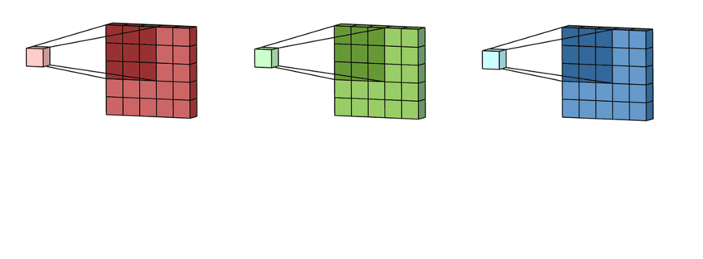
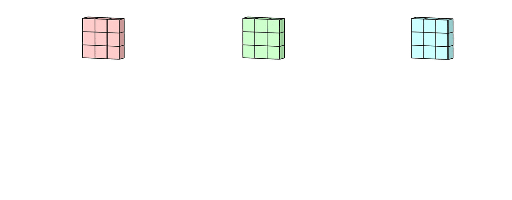

# 多通道卷积

多通道卷积过程如下，每个kernel都应用于前一层的输入通道，以生成一个输出通道。我们对所有kernel重复这个过程以生成多个通道。然后将这些通道汇总在一起，形成一个单独的输出通道。

这里的输入层是一个5×5×3的矩阵，有3个通道。filter是一个3×3×3矩阵。首先，filter中的每个kernel分别应用于输入层中的三个通道。执行三个卷积，得到3个通道，大小为3 x 3。

在5\*5矩阵上执行遍历的就是每一个kernel。然后这三个输出的通道相加\(元素相加\)形成一个单独的通道\(3 x 3 x 1\)。这个最终的单通道是使用filter\(3 x 3 x 3矩阵\)对输入层\(5 x 5 x 3矩阵\)进行卷积的结果。


输入层的通道数和filter的kernel数量是相等的


