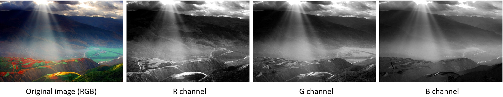

# 基本概念

## layer

层，可以代表输入层，隐藏层，输出层等

## channel

通道，用于表示输入层的结构，例如输入层输入的是一张彩色的图片，就意味的输入层是三通道的，分别是R，G，B。

## feature map

特征图与channnel是等价的概念，

## kernel

卷积核，用于过滤具体特征。泛指二维的权重矩阵

## filter

过滤器由一个或多个卷积核组成。泛指三维结构

## different between kernel and filter

kernel泛指一个二维的权重数组，而filter是指一个或多个kernel堆叠在一起的三维结构。

对于灰度图来说，他的输入就是一通道的，所以就用一个2D的过滤器就可以操作，此时filter与kernel是相同的。

但是对于彩色图来说，他的输入是三通道的，用一个2D的过滤器已经不能解决这个问题了，所以要用一个3D的过滤器，其中堆叠三个卷积核。

## stride

它定义了在图像中滑动时内核的步长。跨度为1表示内核逐像素滑动通过图像。跨度为2表示内核通过每步移动2个像素（即跳过1个像素）在整个图像中滑动。我们可以使用跨度（&gt; = 2）对图像进行下采样。

## padding

填充，如何处理样本的边界。一般有两种方式

* 填充-same
* 舍弃-valid

填充定义了图像边框的处理方式。填充卷积（在Tensorflow中使用“相同”填充）将通过在输入边界周围填充0来保持空间输出尺寸等于输入图像。另一方面，未填充的卷积（在Tensorflow中为“有效”填充）仅对输入图像的像素执行卷积，而在输入边界周围不添加0。输出大小小于输入大小。

## pooling

池化也就是对卷积后的结果做进一步的处理。一般由以下三种方式

* max pooling
* average pooling
* stochastic pooling

