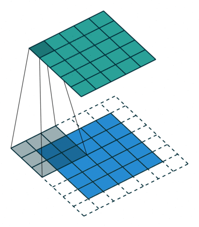

# 卷积整体流程

## 图解卷积

* 在这张图中我们首先输入了一个28\*28的图像，这个图像是灰度图只有一通道也就是对应的①
* 然后我们将这个图片用25个filter做卷积，每个filter大小是3\*3的。此时每个filter的参数就是3\*3=9
* 经过②后我们得到③，这是一个26\*26带有25通道的图片，接下来我们做一次pooling
* 得到④，这是一个13\*13带有25通道的图片，接下来我们将④用50个filter做卷积
* 注意⑤中，每个filter中包含25个kernel，所以在⑤中，每个filter的参数是3\*3\*25=225
* 做完卷积之后，得到一个11\*11带有50通道的图片，也就是⑥
* 再将⑥做一次pooling，得到一个5\*5带有50通道的图片，也就是⑦

下图说明了使用内核大小3，步幅1和填充1的2D卷积。

对于输入图像大小为$$i$$，kernel大小为$$k$$，填充为$$p$$，步长为$$s$$，卷积的输出图像的大小为$$o$$，那么存在以下公式：

$$
o=\operatorname{lower}_{-} \text {bound }\left(\frac{i+2 p-k}{s}\right)+1
$$

## 卷积动态流程

来源：[https://poloclub.github.io/cnn-explainer/](https://poloclub.github.io/cnn-explainer/)

